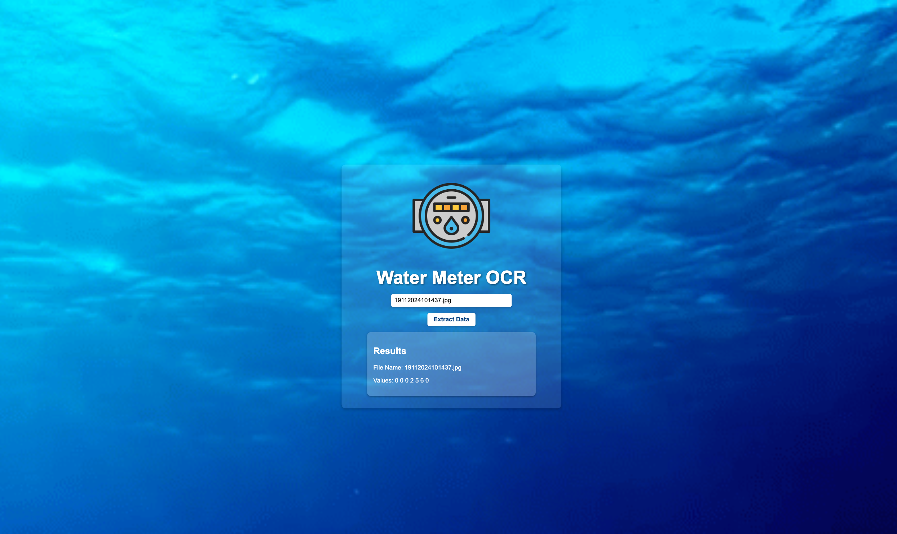
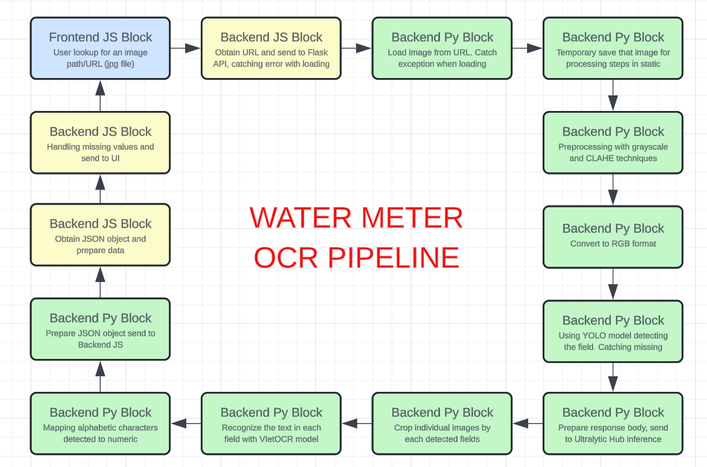
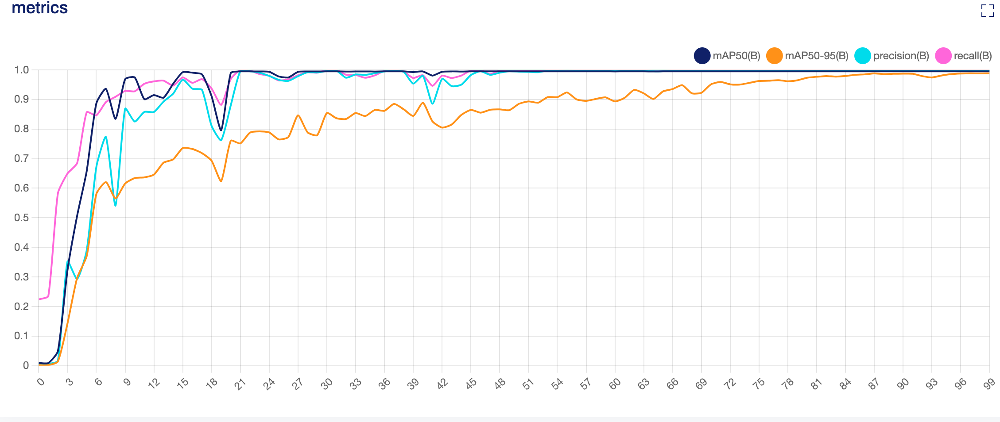
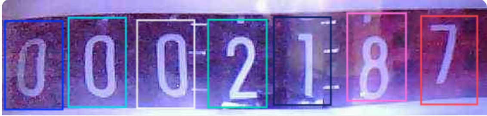
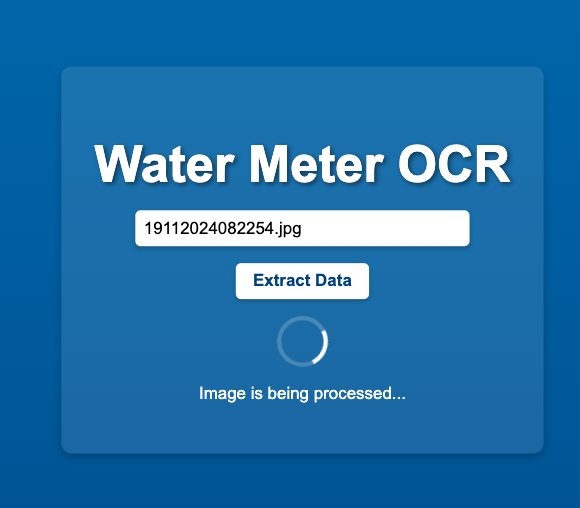
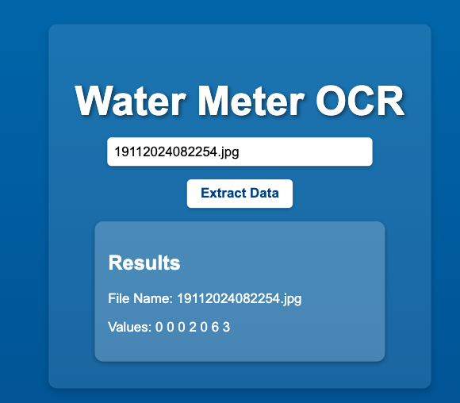

# Ứng dụng OCR cho Đồng Hồ Nước

Dự án này là một ứng dụng OCR (Nhận dạng ký tự quang học) tiên tiến được thiết kế để trích xuất các giá trị đồng hồ nước từ hình ảnh. Nó kết hợp sức mạnh của YOLOv5 để phát hiện trường và VietOCR để nhận dạng ký tự, với giao diện Next.js phía trước và Flask phía sau.

## 1. Tính năng
- Tiền xử lý hình ảnh bằng kỹ thuật xám hóa và CLAHE.
- Phát hiện các trường cụ thể trong ảnh đồng hồ nước bằng YOLOv5 (mô hình `yolov5xu.pt`) và YOLOv11 (`yolov11l.pt`).
- Trích xuất và nhận dạng văn bản từ mỗi trường được phát hiện bằng VietOCR (mô hình `vgg_transformer.pth`).
- Xử lý linh hoạt các giá trị thiếu, ghi nhật thông báo gừi lỗi khi phát hiện lỗi.
- Giao diện trước đơn giản để nhập tên tệp và xem kết quả trích xuất.

Giao diện trước:  


---

## 2. Công nghệ được sử dụng
- **Next.js**: Framework cho giao diện trước.
- **Flask**: Framework Python cho giao diện sau.
- **YOLO**: Mô hình YOLOv11l và v5xu để phát hiện trường.
- **VietOCR**: Mô hình nhận dạng văn bản.
- **Axios**: HTTP client để giao tiếp giữa Next.js và Flask.
- **Vercel**: Nền tảng triển khai giao diện trước Next.js.
- **Render**: Nền tảng triển khai API Flask.

---

## 3. Cấu trúc thư mục
```
water-meter-ocr/
├── flask-server/            # API Flask YOLO & VietOCR
│   ├── app.py               # Tệp Flask application
│   ├── models/              # Thư mục chứa các mô hình YOLO và VietOCR
│   │   ├── yolov11l.pt      # Mô hình YOLOv11l cho phát hiện trường
│   │   ├── yolov5xu.pt      # Mô hình YOLOv5xu cho phát hiện trường
│   │   └── vgg_transformer.pth # Mô hình VietOCR nhận dạng văn bản
│   ├── requirements.txt     # Các phụ thuộc Python
│   └── static/              # Thư mục cho các tài sản tình
├── nextjs-client/           # Ứng dụng giao diện trước Next.js
│   ├── pages/
│   │   ├── api/
│   │   │   └── extract.js   # API proxy giao tiếp với Flask server
│   │   └── index.js         # UI chính cho ứng dụng
│   ├── styles/              # Thư mục CSS cho giao diện Next.js
│   │   └── Home.module.css
└── dataset/                 # Dataset mẫu để huấn luyện YOLO
    ├── images/
    ├── labels/
    ├── labelme/             # Nhãn thuật định bằng LabelMe
    ├── config.yaml/         # Cấu hình YOLO
    └── convert_json_to_txt.py
```

---

## 4. Quy trình dự án
Quy trình dự án:  
  

---
Here is the translated section of the README into Vietnamese for your `README-vi.md` file:

```markdown
## 5. Cài Đặt và Thiết Lập
### Yêu Cầu Trước
- Python 3.8+ được cài đặt cho server Flask.
- Node.js và npm được cài đặt cho client Next.js.
- Một tài khoản Vercel để triển khai.

### Thiết Lập Server Flask
1. Điều hướng đến thư mục `flask-server/`:
   ```bash
   cd flask-server
   ```

2. Tạo và kích hoạt môi trường ảo:
   ```bash
   python3 -m venv venv
   source venv/bin/activate # Trên Linux/Mac
   venv\Scripts\activate    # Trên Windows
   ```

3. Cài đặt các phụ thuộc cần thiết:
   ```bash
   pip install -r requirements.txt
   ```

4. Chạy server Flask:
   ```bash
   python app.py
   ```
   Server Flask sẽ khả dụng tại `http://localhost:5001`.

### Thiết Lập Client Next.js
1. Điều hướng đến thư mục `nextjs-client/`:
   ```bash
   cd nextjs-client
   ```

2. Cài đặt các phụ thuộc:
   ```bash
   npm install
   ```

3. Chạy server phát triển:
   ```bash
   npm run dev
   ```

4. Mở trình duyệt và truy cập `http://localhost:3000` để sử dụng ứng dụng.

### Triển Khai Trên Vercel
1. Cài đặt Vercel CLI:
   ```bash
   npm install -g vercel
   ```

2. Triển khai client Next.js:
   ```bash
   cd nextjs-client
   vercel
   ```
   - Làm theo các hướng dẫn để liên kết hoặc tạo một dự án mới.

3. Triển khai server Flask (tùy chọn):
   Lưu trữ server Flask trên các nền tảng như AWS, Render, hoặc Heroku nếu bạn muốn nó khả dụng trực tuyến.

## Cách Sử Dụng
1. Truy cập ứng dụng đã triển khai.
2. Nhập tên tệp hoặc URL của hình ảnh đồng hồ nước.
3. Nhấp vào "Extract Data" để nhận kết quả OCR.
4. Xem các giá trị được trích xuất cho từng trường, được gắn nhãn là `v1` đến `v7`.

---

## 6. Cấu Hình Mô Hình
### **YOLOv11L:**  
#### a. Cấu Hình:  
```yaml
batch: -1                 # Kích thước batch cụ thể
cache: "ram"              # Sử dụng RAM để lưu trữ
device: "gpu"      
epochs: 300               # Huấn luyện trong nhiều epochs hơn
imgsize: 640              
patience: 100
lr0: 0.001                # Tốc độ học để ổn định
optimizer: "AdamW"        # Sử dụng trình tối ưu AdamW
augment: True             # Bật các kỹ thuật tăng cường
weights: "yolov11l.pt"    # Bắt đầu với trọng số đã được huấn luyện
```

#### b. Đánh Giá Mô Hình:  
    

### **YOLOv5xu:**  
#### a. Cấu Hình:  
```yaml
batch: 32                 # Kích thước batch cụ thể
cache: "ram"              # Sử dụng RAM để lưu trữ
device: "gpu"      
epochs: 300               # Huấn luyện trong nhiều epochs hơn
imgsize: 640              
patience: 100
lr0: 0.001                # Tốc độ học để ổn định
optimizer: "AdamW"        # Sử dụng trình tối ưu AdamW
augment: True             # Bật các kỹ thuật tăng cường
weights: "yolov5xu.pt"    # Bắt đầu với trọng số đã được huấn luyện
```

#### b. Đánh Giá Mô Hình:  
    

**Ghi Chú Về Lựa Chọn Mô Hình:** Dòng YOLOv5u của Ultralytics là một phiên bản tiên tiến của YOLOv5, tích hợp cơ chế phát hiện không cần anchor và head chia objectness-free, cải thiện sự cân bằng giữa độ chính xác và tốc độ cho các tác vụ phát hiện đối tượng thời gian thực.  

### Đầu Ra Phát Hiện Trường
Mỗi trường được phát hiện được gắn nhãn là `v1` đến `v7` (ví dụ: `v1` cho trường đầu tiên, `v2` cho trường thứ hai, v.v.).  



---

### **Cấu Hình VietOCR**
- **Mô Hình**: `vgg_transformer.pth`
- **Mục Đích**: Nhận dạng văn bản trong các trường được cắt bởi YOLO.
- **Huấn Luyện**: Tinh chỉnh trên tập dữ liệu đồng hồ nước để đạt độ chính xác cao hơn.   

**Sử Dụng:** Clone VietOCR bằng:
```
git clone https://github.com/pbcquoc/vietocr.git
```

---

### Ví Dụ Đầu Ra
API trả về một đối tượng JSON với các giá trị trường:
```json
{
    "fields": {
        "v1": "123",
        "v2": "456",
        "v3": "",
        "v4": "789",
        "v5": "",
        "v6": "321",
        "v7": "654"
    }
}
```

---

### Trình Bày Giao Diện  
Xử lý và loading:    
    

Đưa ra kết quả phỏng đoán:    
   

## Xử lý lỗi  
Với nhãn bị thiếu, sẽ được lưu là (`""`) và log tin báo lỗi.  

---

## Hosting and Deployments
Giao diện Vercel [Water Meter](https://water-meter-scanner.vercel.app/) server Flask API server trên Render [Sao chép URL](https://watermeterflask.onrender.com).

---

Latest commit on 02/01/2025 | Author: Dang Khoa Le