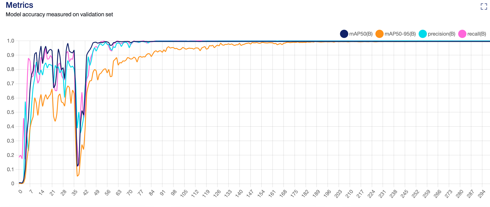

Here is the updated `README.md` file, reflecting the removal of PaddleOCR and the integration of YOLOv5 and VietOCR:

---

# Water Meter OCR Application

This project is an advanced OCR (Optical Character Recognition) application designed to extract water meter values from images. It combines the power of YOLOv5 for field detection and VietOCR for character recognition, with a Next.js front end and a Flask back end.

## Features
- Detects specific fields in water meter images using YOLOv5 (`yolov11l.pt` model).
- Extracts and recognizes text from each detected field using VietOCR (`vgg_transformer.pth` model).
- Handles missing values gracefully, logging debug messages for any undetected fields.
- Simple front-end interface for file input and visualization of extracted results.

## Technologies Used
- **Next.js**: Framework for the front end.
- **Flask**: Python framework for the back end.
- **YOLOv5**: Model for field detection.
- **VietOCR**: Model for text recognition.
- **Axios**: HTTP client for communication between Next.js and Flask.
- **Vercel**: Deployment platform for the Next.js front end.

## File Structure
```
water-meter-ocr/
├── flask-server/            # Flask-based YOLO & VietOCR API server
│   ├── app.py               # Flask application file
│   ├── models/              # Folder containing YOLO and VietOCR models
│   │   ├── yolov11l.pt      # YOLO model for field detection
│   │   └── vgg_transformer.pth # VietOCR model for text recognition
│   ├── requirements.txt     # Python dependencies for the server
│   └── static/              # Optional folder for any static assets (e.g., test images)
├── nextjs-client/           # Next.js frontend application
│   ├── pages/
│   │   ├── api/
│   │   │   └── extract.js   # API proxy to communicate with the Flask server
│   │   └── index.js         # Main UI for the application
│   ├── styles/              # Styles for the Next.js app
│   │   └── Home.module.css
├── dataset/                 # Example dataset to be trained with YOLO
│   ├── images/
│   │   └── train/
│   │   │   └── img1.jpg
│   │   │   └── img2.jpg
│   │   │   └── img3.jpg
│   ├── labels/
│   │   └── train/
│   │   │   └── img1.txt
│   │   │   └── img2.txt
│   │   │   └── img3.txt
│   ├── labelme/             # Manual label files with LabelMe
│   ├── config.yaml/         # YOLO config
│   ├── classes.txt/        
│   ├── convert_json_to_txt.py


```

## Installation and Setup

### Prerequisites
- Python 3.8+ installed for the Flask server.
- Node.js and npm installed for the Next.js client.
- A Vercel account for deployment.

### Setting Up the Flask Server
1. Navigate to the `flask-server/` directory:
   ```bash
   cd flask-server
   ```

2. Create and activate a virtual environment:
   ```bash
   python3 -m venv venv
   source venv/bin/activate # For Linux/Mac
   venv\Scripts\activate    # For Windows
   ```

3. Install the required dependencies:
   ```bash
   pip install -r requirements.txt
   ```

4. Run the Flask server:
   ```bash
   python app.py
   ```
   The Flask server will be available at `http://localhost:5001`.

### Setting Up the Next.js Client
1. Navigate to the `nextjs-client/` directory:
   ```bash
   cd nextjs-client
   ```

2. Install dependencies:
   ```bash
   npm install
   ```

3. Run the development server:
   ```bash
   npm run dev
   ```

4. Open your browser and navigate to `http://localhost:3000` to access the application.

### Deployment on Vercel
1. Install the Vercel CLI:
   ```bash
   npm install -g vercel
   ```

2. Deploy the Next.js client:
   ```bash
   cd nextjs-client
   vercel
   ```
   - Follow the prompts to link or create a new project.

3. Deploy the Flask server (optional):
   Host the Flask server on platforms like AWS, Render, or Heroku if you want it accessible online.

## How to Use
1. Navigate to the deployed application.
2. Input the file name or URL of the water meter image.
3. Click "Extract Data" to get the OCR results.
4. View extracted values for each field, labeled as `v1` to `v7`.

## Model Configuration

### **YOLOv5 Configuration**
#### a. Training Parameters


### **YOLOv11L:**  
#### a. Configuration:  
```yaml
batch: 32                 # Specific batch size
cache: "ram"              # Use RAM for caching
device: "gpu"      
epochs: 300               # Train for more epochs
imgsize: 640              
patience: 100
lr0: 0.001                # Learning rate for stability
optimizer: "AdamW"        # Use AdamW optimizer
augment: True             # Enable advanced augmentations
weights: "yolov11l.pt"    # Start with pretrained weights
```

#### b. Model Evaluation:  
    


#### c. Field Detection Output
Each detected field is labeled as `v1` to `v7` (e.g., `v1` for the first field, `v2` for the second, and so on).

---

### **VietOCR Configuration**
- **Model**: `vgg_transformer.pth`
- **Use**: Recognizes text in cropped fields detected by YOLO.
- **Training**: Fine-tuned on water meter datasets for better accuracy.

---

### Example Output
The API returns a JSON object with field values:
```json
{
    "fields": {
        "v1": "123",
        "v2": "456",
        "v3": "",
        "v4": "789",
        "v5": "",
        "v6": "321",
        "v7": "654"
    }
}
```

## Debugging
If any field is undetected, an empty string (`""`) is returned for that field, and an error message is logged.

---